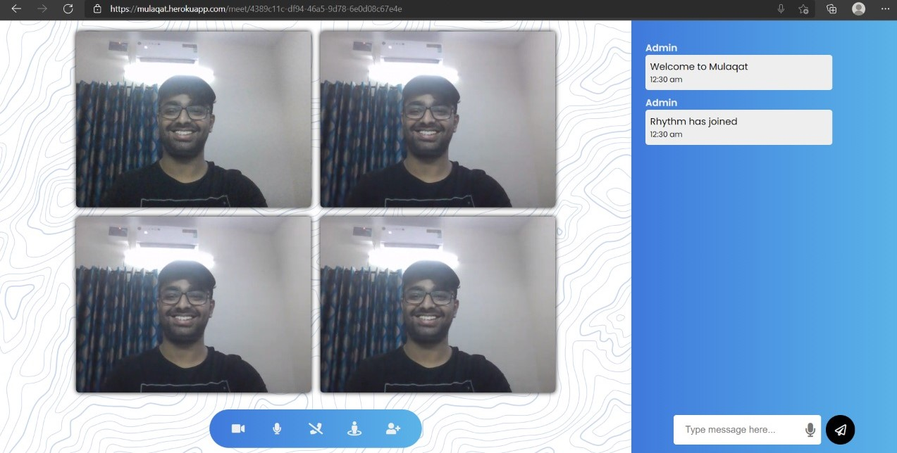

# Mulaqat---Video-Chat-Application | Microsoft Engage 2021 | Rhythm Narula
> Mulaqat provides robust video-calling & messaging platform for users to connect and be productive.It a simple web based application made using peerJs library
> Live demo [_here_](https://mulaqat.herokuapp.com). 

## Table of Contents
* [General Info](#general-information)
* [Technologies Used](#technologies-used)
* [Features](#features)
* [Screenshots](#screenshots)
* [Setup](#setup)

## General Information
- This project is a video chat application made under Microsoft Enagage Program

## Technologies Used
### Frontend
- HTML ( EJS template)
- CSS
- JS

### Backend
- Node.js
- Express.js
- socket.io

### Real-Time Communication
- peerJs

## Features
- Video Call for more than 2 participants
- Can make Multiple meetings simultaneously
- Video on/off
- Mic on/off
- Chat in meeting
- Authentication
- ChatBot
- Voice To Text
- Live Location sharing
- Wonderful UI

## Screenshots



## Setup
To run this project locally, clone this repository and open root folder
install it dependencies using npm:
```
$ npm install
$ npm start
```
Server will start at port 5000

In the root folder ,open another terminal and run 
```
$ peerjs --port 5001
```
This will start you peerserver at port 5001

Create your application on google , facebook and github console
and register your callback url mentioned in server.js file corresponding to every authentication strategy

Create .env file in root folder and add these details from the created application
- GOOGLE_CLIENT_ID=
- GOOGLE_CLIENT_SECRET=

- FACEBOOK_APP_ID=
- FACEBOOK_APP_SECRET=

- GITHUB_CLIENT_ID=
- GITHUB_CLIENT_SECRET=

Visit localhost:5000


